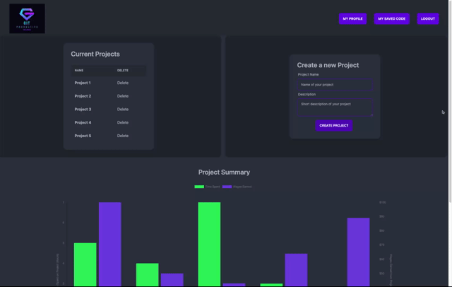
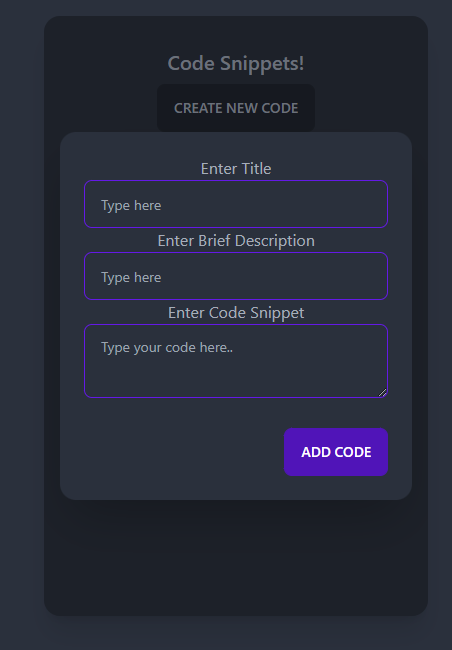

# Git Productive

Click <a href="https://git-productive.herokuapp.com/" target="_blank">**here**</a> to check out the deployed weather app!


## **Table Of Contents**
1. [Description](#description)
2. [Installation](#installation)
3. [Usage](#usage)
4. [Features](#features)
    - [Homepage](#homepage)
    - [Login Signup](#login-signup)
    - [Profile Page](#profile-page)
    - [Project Page](#project-page)
    - [Code Page](#code-snippet-page)
5. [Technologies Used](#technologies-used)
6. [Authors](#author)
7. [License](#license)

## **Description**

Git Productive is an innovative web application that is designed to help developers with the organization of their day. This app will start on the home page and the existing user can  login or a new user can sign up to get them to their profile page. From the profile page the user can access their current and past projects, create a new project, and view and add pieces of code to access later. This site is meant to alleviate any extra tasks or thinking for the user, as it will set reminders for them when its time to get up and move around, track the amount of time they have worked on a specific project, and let them store and access crucial code in an organized fashion to reference later.
  
## **Installation**

1. Clone down the repo from [this link](https://github.com/jkwalsh127/git-productive) by `git clone git@github.com:jkwalsh127/git-productive.git` in your terminal
2. To get all necessary packages, run `npm install` in the command line
3. In the command line, run `mysql -u root -p` to get into MySQL shell
4. In MySQL shell run `source db/schema.sql` . Once all rows are running correctly, `exit` MySQL shell
5. Once back at the main command line, run `node seeds/index.js` to seed your data and then `node server.js` to run your server
 
 Please note Node.js is required for the application to run

## **Usage**

Once everything is properly installed and running, the user will be able to open the link on the command line or create a new URL from Heroku. 


## **Features**

We have five significant features within our site that gives it the full functionality:
- Homepage
- Login
- Profile
- Projects
- Code Snippets


### **Homepage**

The homepage of this web application was mean to be the first page any user sees to get more information on what Git Productive is. It is designed for the desired user to be web developers but can be used  by anyone trying to keep track of essential projects throughout the day while staying on track with time, and keeping essential notes that can be referenced later. An existing user can use the homepage as a way to initially login and then they can access everything from the profile and project pages once logged in.

To add some functionality to the homepage, we implemented [AnimeJS](https://animejs.com/) so that it was not just a static landing page. When the web application is refreshed, some features on the page will move around a bit to make the page seem more alive. There are small details throughout the entire web app that will move around to give it a more live feel.


### **Login Signup**

The Login and Signup page meant to display a card-like feature that asks the user login info. The user is able to click on the sign-in button and see inputs for username, email and password. If no account, user can click"sign up" button with a link taking them to the Signup page. For the logout function, we displayed a button on the browser. When a user presses logout, the session will be destroyed.

We create the User model to include "id", "username" and "password", and added hooks to hash user's password using [Bcrypt](https://www.npmjs.com/package/bcrypt). On front-end, the login and signup button listen to the user and onclick they fetch api from the server and redirect them to the homepage if succeed. The server on the backend has GET POST DELETE api routes to render, create and delete corresponding user data. The server also create and save a session when user signup/login and destory the session when user logout. 


### **Profile Page**

The profile page is a User’s dashboard to display their activity on the app. Here they can see a list of their projects as well as create a new project. They can also see a chart that displays the amount of time spent on each project and the corresponding wages earned. A project history card and a new project card were created for users to create new project and vuew project history. When clicking on the specific project name in history list, user is redirected to that project page where they can start working and track their work.

Project model is created with key of "id", "name", "description". The backend is serving api routes to GET - render all the project history list; POST - create a new project; DELETE - delete a project. The fontend fetch the api and refresh the page when user interact with the page.



### **Project Page**

The Project page is where a user goes to use the timer feature when they are actively working on a single project. The timer's primary function is to allow a user to set the time they would like to work before taking a break. When the timer goes off, the user is prompted with a few exercise suggestions. Once the user selects to continue coding, the previous work session is added to the total time spent on the project. Using the wage set by the user ahead of time, a quick calculation is done to render the total value of the time spent. Both the total time and total value are added to the database once the user selects the save button. 


### **Code Snippet Page**

The code snippet page is an added features to add to the functionality to this web app. While creating this, we felt it would be a beneficial tool to be able to add and label specific pieces of code to reference later instead of going  through old repositories to find the snippets of code you want to use again. With this added feature, the user can clearly label the piece of code they want to save, give a brief description of what it is, and then paste the piece of code to access at a later date.



This page was generated with standard routes on the front end and backend for POST and DELETE routes to create and delete different pieces of code. The page will render each time a new piece of code is generated and will show on the content cards after created. A new feature our team overcame during  production of the web app was realizing when having an event listener from a query selector, it will only be looking for one click at a time, resulting in the rest of the buttons not being able to function. To resolve this issue, our team came up with the following code as a solution: 

```
const codeList = document.querySelectorAll(".code-list");
for (var i = 0; i < codeList.length; i++) {
  codeList[i].addEventListener("click", delButtonHandler);
}
```

This allows all the delete buttons to have the event listener on and not just one of them at a time.

## **Technologies Used**

* [NodeJS](https://nodejs.org/en/) 
* [Tailwind CSS](https://tailwindcss.com/docs/installation)
* [Google Fonts](https://fonts.google.com/)
* [daisyUI](https://daisyui.com/)
* [AnimeJS](https://animejs.com/)
* [My SQL](https://www.mysql.com/)
* [Sequelize](https://sequelize.org/)
* [Handlebars](https://www.npmjs.com/package/handlebars)
* [Bcrypt](https://www.npmjs.com/package/bcrypt)
* [Connect Session Sequelize](https://www.npmjs.com/package/connect-session-sequelize)
* [Express](https://expressjs.com/)
* [Express Session](https://www.npmjs.com/package/express-session)
* [dotenv](https://www.npmjs.com/package/dotenv)

## **Authors**

* [Sienna Li](https://github.com/siennameow)
* [Jake Walsh](https://github.com/jkwalsh127)
* [Kylie Shinn](https://github.com/kyliemshinn)

## **License**

Git Productive is available under the MIT license. For licensing details see License document.
